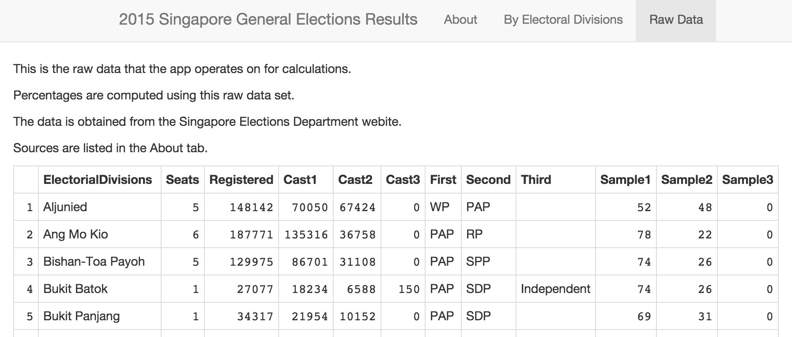

<style>
.small-code pre code {
  font-size: 1em;
}
</style>

2015 Singapore General Elections Results
========================================================
author: Jason Chionh
date: 26 September 2015

A Shiny App

https://jchionh.shinyapps.io/GE2015Results


Introduction
========================================================
I built a Shiny App for displaying the Singapore General Election 2015 results. 

https://jchionh.shinyapps.io/GE2015Results

My data is constructed by parsing the results at both URLs:

- http://www.eld.gov.sg/election_results_2015.html
- http://www.eld.gov.sg/samplecount2015.html

Sample Raw Data
========================================================
class: small-code
Here's a sampling of the raw data that my app uses:

```r
gedat <- read.csv("data/GE2015ResultsData.csv")
```
You can view the data on the **Raw Ddata** tab of the app:



Computations
========================================================
class: small-code
The application grabs raw data of number of registered voters, number of votes casted, and make these computations:

- Vote percentage for each contesting candidate group:

```r
chose <- gedat[gedat$ElectorialDivisions == "Aljunied",]
total <- chose$Cast1 + chose$Cast2 + chose$Cast3
round(chose$Cast1 / total * 100, digits=2)
```

```
[1] 50.96
```

- Rejected votes and the percentage for each Division:

```r
format(chose$Registered - total, big.mark=",")
```

```
[1] "10,668"
```

```r
round((chose$Registered - total) / chose$Registered * 100, digits=2)
```

```
[1] 7.2
```

Application Example
========================================================
With a drop-down box, you can choose to view the results of the electorial division, with computed percentages:


